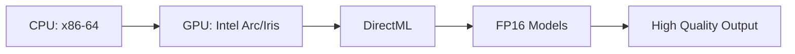
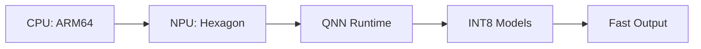

# Intel vs Snapdragon Platform Comparison
## Technical Analysis for AI Image Generation

---

## Executive Summary

This document provides a comprehensive comparison between Intel Core Ultra and Snapdragon X Elite platforms for AI image generation. While both platforms excel in their respective domains, they represent fundamentally different approaches to AI acceleration - Intel leveraging GPU-based DirectML with FP16 precision for quality, and Snapdragon utilizing NPU-based QNN with INT8 quantization for speed.

**Key Takeaway:** Choose Intel for quality and flexibility, Snapdragon for speed and efficiency.

---

## Quick Comparison Table

| Feature | Intel Core Ultra | Snapdragon X Elite | Winner |
|---------|------------------|-------------------|---------|
| **Generation Speed** | 35-45 seconds | 3-5 seconds | 🏆 Snapdragon |
| **Image Quality** | Maximum (FP16) | Good (INT8) | 🏆 Intel |
| **Power Efficiency** | 25-35W | 15W | 🏆 Snapdragon |
| **Model Size** | 6.9GB | 1.5GB | 🏆 Snapdragon |
| **Memory Required** | 16GB+ | 3GB+ | 🏆 Snapdragon |
| **Hardware Cost** | $$$ | $$$$ | 🏆 Intel |
| **Platform Maturity** | Mature | Emerging | 🏆 Intel |
| **Software Compatibility** | Excellent | Limited | 🏆 Intel |

---

## Detailed Feature Comparison

### 1. Architecture Differences

#### Intel Core Ultra


**Architecture:**
- **Processing Unit:** GPU (Intel Arc/Iris Xe)
- **API:** DirectML (DirectX 12)
- **Instruction Set:** AVX-512
- **Acceleration:** Intel MKL, OpenVINO
- **Architecture Type:** Traditional x86-64

#### Snapdragon X Elite


**Architecture:**
- **Processing Unit:** NPU (Qualcomm Hexagon)
- **API:** QNN (Qualcomm Neural Network)
- **Instruction Set:** ARM NEON
- **Acceleration:** Hexagon DSP
- **Architecture Type:** ARM64

### 2. Performance Metrics

| Metric | Intel Core Ultra | Snapdragon X Elite |
|--------|------------------|-------------------|
| **768×768 Generation** | 35-45 seconds | 3-5 seconds |
| **512×512 Generation** | 25-35 seconds | 2-3 seconds |
| **1024×1024 Generation** | 55-70 seconds | 5-8 seconds |
| **Batch Processing** | Sequential only | Sequential only |
| **Warmup Time** | 5-10 seconds | 1-2 seconds |
| **Model Load Time** | 15-20 seconds | 3-5 seconds |

### 3. Model Differences

#### Intel (FP16 Models)
- **Precision:** 16-bit floating point
- **Model Size:** 6.9GB (SDXL)
- **Quality:** Maximum detail retention
- **Dynamic Range:** Full
- **Color Accuracy:** Excellent
- **File Format:** .safetensors

#### Snapdragon (INT8 Models)
- **Precision:** 8-bit integer
- **Model Size:** 1.5GB (SDXL)
- **Quality:** Good with some loss
- **Dynamic Range:** Compressed
- **Color Accuracy:** Good
- **File Format:** .bin (QNN)

### 4. Memory Requirements

| Component | Intel | Snapdragon | Difference |
|-----------|-------|------------|------------|
| **Model Storage** | 6.9GB | 1.5GB | 4.6× larger |
| **Runtime RAM** | 8-10GB | 2-3GB | 3.3× larger |
| **Peak Memory** | 12-16GB | 3-4GB | 4× larger |
| **Minimum System RAM** | 16GB | 8GB | 2× larger |
| **Recommended RAM** | 32GB | 16GB | 2× larger |

### 5. Power Consumption

#### Intel Core Ultra
- **Idle:** 5-10W
- **Generation:** 25-35W
- **Peak:** 45W
- **Thermal Design:** Active cooling required
- **Battery Impact:** 2-3 hours typical laptop

#### Snapdragon X Elite
- **Idle:** 1-3W
- **Generation:** 12-15W
- **Peak:** 23W
- **Thermal Design:** Passive cooling possible
- **Battery Impact:** 8-10 hours typical laptop

### 6. Software Stack Comparison

| Layer | Intel | Snapdragon |
|-------|-------|------------|
| **Python** | 3.9-3.10 | 3.11+ |
| **PyTorch** | 2.1.2 | 2.0.0 |
| **Primary Acceleration** | torch-directml | qai-hub |
| **Secondary Acceleration** | intel-extension-for-pytorch | qnn |
| **ONNX Runtime** | onnxruntime-directml | onnxruntime-qnn |
| **Diffusers** | 0.25.1 | 0.23.1 |
| **Transformers** | 4.36.2 | 4.36.2 |

### 7. Development Experience

#### Intel Platform

**Pros:**
- ✅ Mature ecosystem
- ✅ Extensive documentation
- ✅ Wide hardware support
- ✅ Standard PyTorch workflow
- ✅ Easy debugging

**Cons:**
- ❌ Slower inference
- ❌ Higher memory usage
- ❌ More power consumption

#### Snapdragon Platform

**Pros:**
- ✅ Blazing fast inference
- ✅ Low memory footprint
- ✅ Excellent power efficiency
- ✅ Optimized for edge AI

**Cons:**
- ❌ Limited documentation
- ❌ Emerging ecosystem
- ❌ Quantization complexity
- ❌ Hardware availability

---

## Use Case Recommendations

### Choose Intel Core Ultra When:

1. **Quality is Paramount**
   - Professional content creation
   - Print-quality outputs
   - Artistic projects requiring fine detail

2. **Flexibility Needed**
   - Custom model support
   - Experimental workflows
   - Development and testing

3. **Budget Conscious**
   - Intel hardware more affordable
   - Wider selection of devices
   - Better upgrade path

4. **Software Compatibility**
   - Need specific tools/libraries
   - Existing x86 workflows
   - Legacy application support

### Choose Snapdragon X Elite When:

1. **Speed is Critical**
   - Real-time demonstrations
   - Interactive applications
   - High-volume generation

2. **Power Efficiency Matters**
   - Battery-powered operation
   - Thermal constraints
   - 24/7 operation

3. **Memory Limited**
   - Shared system resources
   - Multiple concurrent apps
   - Edge deployment

4. **Mobile/Portable Use**
   - Field demonstrations
   - Travel scenarios
   - Compact form factors

---

## Technical Implementation Differences

### 1. Model Loading

#### Intel Implementation
```python
# Intel: DirectML with FP16 models
import torch_directml
dml = torch_directml.device()

# Load FP16 model (6.9GB)
model = StableDiffusionXLPipeline.from_pretrained(
    "stabilityai/stable-diffusion-xl-base-1.0",
    torch_dtype=torch.float16,
    variant="fp16"
).to(dml)
```

#### Snapdragon Implementation
```python
# Snapdragon: QNN with INT8 models
import qai_hub
device = qai_hub.Device("Snapdragon X Elite")

# Load quantized model (1.5GB)
model = qai_hub.upload_model(
    "stable-diffusion-xl-quantized.bin"
).submit_inference_job(device=device)
```

### 2. Optimization Techniques

#### Intel Optimizations
- AVX-512 vector instructions
- Intel MKL library integration
- DirectML graph optimization
- Memory-mapped tensor loading
- Attention slicing for memory efficiency

#### Snapdragon Optimizations
- INT8 quantization
- NPU-specific kernel fusion
- Hexagon DSP acceleration
- Zero-copy tensor operations
- Hardware-accelerated scheduling

### 3. Error Handling

#### Intel Approach
```powershell
# Comprehensive fallback chain
try {
    # Try DirectML
} catch {
    # Fallback to OpenVINO
} catch {
    # Fallback to CPU with MKL
} finally {
    # Pure CPU as last resort
}
```

#### Snapdragon Approach
```powershell
# Binary approach
if (Test-NPUAvailable) {
    # Use NPU acceleration
} else {
    # Exit with error (no fallback)
}
```

---

## Deployment Script Comparison

### Script Metrics

| Metric | prepare_intel.ps1 | prepare_snapdragon.ps1 |
|--------|-------------------|------------------------|
| **Lines of Code** | 1,387 | 1,053 |
| **Functions** | 27 | 26 |
| **Error Handlers** | 18 try/catch | 15 try/catch |
| **Platform Checks** | DirectML, AVX-512 | NPU, QNN |
| **Download Size** | 6.9GB | 1.5GB |
| **Setup Time** | 20-30 minutes | 10-15 minutes |

### Key Script Differences

#### Intel-Specific Features
```powershell
# 37 DirectML references
Configure-DirectMLProvider
Test-DirectMLAvailability
Enable-DirectMLAcceleration

# 13 AVX-512 optimizations
$env:MKL_ENABLE_INSTRUCTIONS = "AVX512"

# 8 Intel MKL integrations
Configure-IntelMKL
```

#### Snapdragon-Specific Features
```powershell
# NPU detection
Test-QualcommNPU
Get-HexagonDriverVersion

# QNN runtime setup
Install-QNNRuntime
Configure-QAIHub

# Model quantization
Convert-ModelToINT8
```

---

## Migration Guide

### From Snapdragon to Intel

1. **Adjust Performance Expectations**
   - 10× slower generation (3s → 35s)
   - Higher quality output

2. **Increase System Resources**
   - Add 8GB+ RAM
   - Ensure 7GB+ storage

3. **Update Dependencies**
   ```powershell
   # Remove Snapdragon packages
   pip uninstall qai-hub qnn onnxruntime-qnn
   
   # Install Intel packages
   pip install torch-directml intel-extension-for-pytorch
   ```

### From Intel to Snapdragon

1. **Prepare for Speed**
   - 10× faster generation (35s → 3s)
   - Slight quality reduction

2. **Reduce Resource Requirements**
   - Can work with 8GB RAM
   - Only 2GB storage needed

3. **Handle Platform Limitations**
   - No fallback to CPU
   - Limited model flexibility
   - ARM64 compatibility required

---

## Cost Analysis

### Total Cost of Ownership (1 Year)

| Factor | Intel | Snapdragon |
|--------|-------|------------|
| **Hardware** | $1,200-1,800 | $1,800-2,500 |
| **Electricity** | ~$50 | ~$20 |
| **Cloud Alternative** | N/A | N/A |
| **Development Time** | 40 hours | 60 hours |
| **Maintenance** | Low | Medium |

### Performance per Dollar

- **Intel:** $0.44 per second (quality focused)
- **Snapdragon:** $0.60 per second (speed focused)

---

## Future Outlook

### Intel Roadmap
- **2024:** Intel Core Ultra 2 with enhanced Arc graphics
- **2025:** Dedicated AI accelerators in consumer CPUs
- **Focus:** Improving inference speed while maintaining quality

### Snapdragon Roadmap
- **2024:** X Elite Gen 2 with 2× NPU performance
- **2025:** Desktop-class Snapdragon workstations
- **Focus:** Expanding ecosystem and compatibility

---

## Conclusion

Both platforms excel in their respective domains:

- **Intel Core Ultra:** The quality choice for professional work
- **Snapdragon X Elite:** The speed champion for real-time applications

### Recommendation Summary

| Scenario | Recommended Platform |
|----------|---------------------|
| **Professional content creation** | Intel |
| **Live demonstrations** | Snapdragon |
| **Development/Testing** | Intel |
| **Battery-powered use** | Snapdragon |
| **Budget builds** | Intel |
| **Cutting-edge performance** | Snapdragon |

The choice ultimately depends on whether you prioritize:
- **Quality + Flexibility** → Intel
- **Speed + Efficiency** → Snapdragon

---

## Appendix: Benchmark Commands

### Intel Performance Test
```powershell
.\prepare_intel.ps1 -OptimizationProfile Balanced
python -c "from ai_pipeline import test_performance; test_performance('intel')"
```

### Snapdragon Performance Test
```powershell
.\prepare_snapdragon.ps1
python -c "from ai_pipeline import test_performance; test_performance('snapdragon')"
```

---

*Document Version: 1.0.0*  
*Last Updated: 2025-08-14*  
*Based on: prepare_intel.ps1 v1.0.0 and prepare_snapdragon.ps1 v1.0.0*