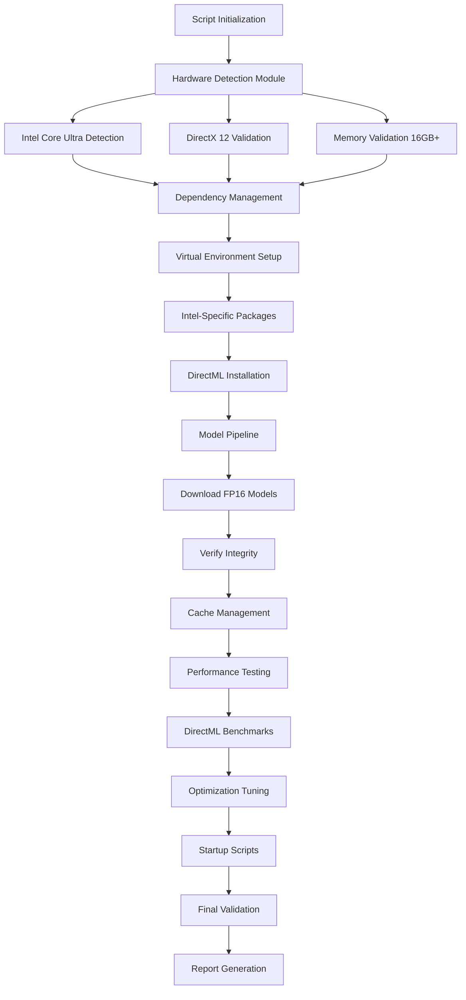
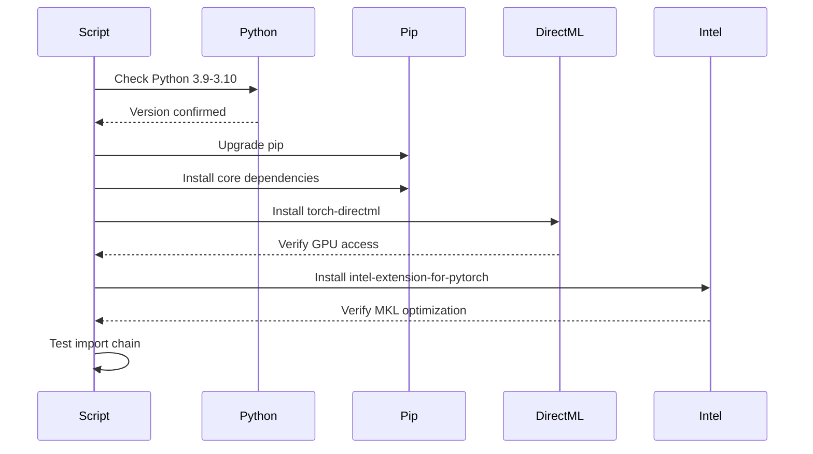

# Intel-Optimized Deployment Script Architecture
## `prepare_intel.ps1` - Complete Technical Specification

---

## Executive Summary

This document provides a comprehensive architecture for an Intel-optimized deployment script (`prepare_intel.ps1`) based on the analysis of the 1053-line Snapdragon deployment script. The Intel version targets consumer-grade Lenovo laptops with Intel Core Ultra processors, utilizing DirectML GPU acceleration for FP16 models with realistic performance expectations of 35-45 seconds per generation.

---

## System Architecture Overview



---

## 1. Hardware Detection Module Design

### Module: `Test-IntelHardwareRequirements`

#### Detection Patterns

```powershell
# Intel Core Ultra Processor Detection Pattern
$processorPattern = @{
    Intel = @(
        "Intel.*Core.*Ultra",
        "Intel.*Core.*i[579].*13\d{2,3}[HUP]",  # 13th gen+
        "Intel.*Core.*i[579].*14\d{2,3}[HUP]"   # 14th gen
    )
}

# DirectX 12 Feature Level Detection
$dx12Requirements = @{
    MinFeatureLevel = "12_0"
    MinWDDMVersion = "2.6"
    RequiredAPIs = @("DirectML", "DirectCompute")
}
```

#### Implementation Specifications

1. **CPU Detection Logic**
   - Query WMI for processor information
   - Match against Intel Core Ultra patterns
   - Extract generation and SKU information
   - Verify AVX-512 instruction set support

2. **GPU/iGPU Detection**
   - Enumerate DirectX adapters via DXGI
   - Check for Intel Arc/Iris Xe Graphics
   - Verify DirectML compatibility
   - Query available VRAM

3. **DirectX 12 Validation**
   - Check Windows version (1903+ required)
   - Verify WDDM driver version
   - Test DirectML provider availability
   - Validate DirectCompute support

4. **Memory Requirements**
   - Minimum: 16GB physical RAM
   - Recommended: 32GB for optimal performance
   - Check available virtual memory
   - Validate page file configuration

5. **Storage Validation**
   - Minimum: 10GB free space
   - Check SSD vs HDD for cache location
   - Verify write permissions
   - Test disk I/O performance

### Function Interface

```powershell
function Test-IntelHardwareRequirements {
    param(
        [switch]$Detailed = $false,
        [switch]$Force = $false
    )
    
    returns @{
        ProcessorValid = $bool
        ProcessorName = $string
        ProcessorGeneration = $int
        AVX512Support = $bool
        DirectX12Valid = $bool
        DirectMLAvailable = $bool
        GPUName = $string
        GPUMemory = $int
        SystemRAM = $int
        StorageAvailable = $int
        OverallStatus = $bool
        Warnings = @()
        Errors = @()
    }
}
```

---

## 2. Dependency Management Architecture

### Module: `Install-IntelDependencies`

#### Package Installation Flow



#### Dependency Structure

1. **Core Dependencies** (from requirements-core.txt)
   - numpy>=1.21.0,<2.0.0
   - pillow>=8.0.0,<11.0.0
   - flask>=2.0.0,<3.0.0
   - PyTorch 2.1.2 (CPU base)

2. **Intel-Specific Stack**
   ```
   torch-directml>=1.12.0
   onnxruntime-directml>=1.16.0
   intel-extension-for-pytorch>=2.0.0
   mkl>=2021.0 (optional)
   intel-openmp (optional)
   ```

3. **Version Pinning Strategy**
   - Lock PyTorch to 2.1.2 for DirectML compatibility
   - Pin transformers to 4.36.2 for stability
   - Use exact versions for critical packages
   - Allow minor updates for utility packages

4. **Fallback Mechanisms**
   - Primary: DirectML GPU acceleration
   - Secondary: Intel OpenVINO (if available)
   - Tertiary: CPU-only with MKL optimizations
   - Emergency: Pure CPU without optimizations

### Error Recovery

```powershell
function Install-IntelDependencies {
    param(
        [string]$VenvPath = "C:\AIDemo\venv",
        [switch]$UseFallback = $false
    )
    
    # Staged installation with rollback points
    $installationStages = @(
        @{Name="Core"; Packages=$corePackages; Critical=$true},
        @{Name="DirectML"; Packages=$directMLPackages; Critical=$false},
        @{Name="Intel"; Packages=$intelPackages; Critical=$false},
        @{Name="Models"; Packages=$modelPackages; Critical=$true}
    )
    
    foreach ($stage in $installationStages) {
        try {
            Install-StagePackages $stage
        } catch {
            if ($stage.Critical) {
                Invoke-Rollback
                throw
            } else {
                Register-Fallback $stage.Name
            }
        }
    }
}
```

---

## 3. Model Pipeline Architecture

### Module: `Download-IntelModels`

#### Download Strategy for Large Files

```powershell
# Progressive download with resume capability
function Download-LargeModel {
    param(
        [string]$URL,
        [string]$Destination,
        [int64]$ExpectedSize = 6900MB,
        [int]$ChunkSize = 10MB,
        [int]$MaxRetries = 3
    )
    
    # Features:
    # - HTTP range requests for resume
    # - SHA256 verification
    # - Progress callback with ETA
    # - Automatic retry on failure
    # - Bandwidth throttling option
}
```

#### Model Storage Structure

```
C:\AIDemo\models\
├── sdxl-base-1.0\
│   ├── unet\
│   │   └── diffusion_pytorch_model.fp16.safetensors (6.9GB)
│   ├── vae\
│   │   └── diffusion_pytorch_model.fp16.safetensors (335MB)
│   ├── text_encoder\
│   │   └── model.fp16.safetensors (246MB)
│   └── text_encoder_2\
│       └── model.fp16.safetensors (1.39GB)
├── cache\
│   ├── downloads\     # Temporary download location
│   └── compiled\      # DirectML compiled kernels
└── checksums.json     # SHA256 hashes for verification
```

#### Download Implementation

```powershell
function Download-IntelModels {
    $models = @(
        @{
            Name = "SDXL-Base-1.0-FP16"
            Files = @(
                @{
                    URL = "https://huggingface.co/stabilityai/stable-diffusion-xl-base-1.0/resolve/main/unet/diffusion_pytorch_model.fp16.safetensors"
                    Size = 6900MB
                    SHA256 = "..."
                },
                # Additional model files...
            )
        }
    )
    
    # Download with progress tracking
    foreach ($model in $models) {
        Write-Progress -Activity "Downloading $($model.Name)" -PercentComplete 0
        
        foreach ($file in $model.Files) {
            Download-WithResume -URL $file.URL -Size $file.Size -SHA256 $file.SHA256
        }
    }
}
```

#### Memory-Efficient Loading

```powershell
# Python code embedded in PowerShell for model loading
$loadModelScript = @"
import torch
import gc
from pathlib import Path

def load_model_efficiently(model_path):
    # Enable memory mapping for large tensors
    torch.backends.cudnn.benchmark = True
    torch.backends.cudnn.deterministic = False
    
    # Load with DirectML device mapping
    import torch_directml
    dml = torch_directml.device()
    
    # Progressive loading with garbage collection
    model = torch.load(
        model_path,
        map_location='cpu',  # Load to CPU first
        mmap=True  # Memory-mapped tensors
    )
    
    # Move to DirectML in chunks
    for param in model.parameters():
        param.data = param.data.to(dml)
        gc.collect()  # Force garbage collection
    
    return model
"@
```

---

## 4. Performance Optimization Strategy

### Module: `Enable-IntelOptimizations`

#### DirectML Configuration

```powershell
function Configure-DirectMLProvider {
    $directMLConfig = @{
        # Device selection
        DeviceId = 0  # Primary GPU/iGPU
        
        # Memory settings
        EnableMemoryArena = $true
        ArenaExtendStrategy = "kSameAsRequested"
        
        # Execution settings
        EnableGraphCapture = $true
        ExecutionMode = "SEQUENTIAL"
        
        # Optimization flags
        GraphOptimizationLevel = "ALL"
        EnableProfiling = $false  # Set true for debugging
    }
    
    # Apply via environment variables
    $env:ORT_DIRECTML_DEVICE_ID = $directMLConfig.DeviceId
    $env:ORT_DIRECTML_MEMORY_ARENA = $directMLConfig.EnableMemoryArena
}
```

#### Intel-Specific Optimizations

1. **AVX-512 Utilization**
   ```powershell
   $env:MKL_ENABLE_INSTRUCTIONS = "AVX512"
   $env:OMP_NUM_THREADS = [Environment]::ProcessorCount
   ```

2. **Intel MKL Integration**
   ```powershell
   $env:MKL_SERVICE_FORCE_INTEL = "1"
   $env:MKL_DYNAMIC = "FALSE"
   $env:MKL_NUM_THREADS = [Math]::Max(4, [Environment]::ProcessorCount / 2)
   ```

3. **DirectML Provider Configuration**
   ```python
   providers = [
       ('DmlExecutionProvider', {
           'device_id': 0,
           'performance_preference': 'high_performance',
           'enable_graph_capture': True
       }),
       'CPUExecutionProvider'
   ]
   ```

4. **Memory Efficiency Settings**
   ```python
   # Attention slicing for memory reduction
   pipeline.enable_attention_slicing(slice_size="auto")
   
   # VAE slicing for large images
   pipeline.enable_vae_slicing()
   
   # CPU offloading for memory-constrained systems
   pipeline.enable_sequential_cpu_offload()
   ```

### Benchmark Design

```powershell
function Test-IntelPerformance {
    param(
        [int]$Steps = 25,
        [string]$Resolution = "768x768"
    )
    
    $benchmarks = @(
        @{Name="Warmup"; Steps=1; Resolution="512x512"},
        @{Name="Speed"; Steps=4; Resolution="512x512"},
        @{Name="Balanced"; Steps=20; Resolution="768x768"},
        @{Name="Quality"; Steps=30; Resolution="768x768"}
    )
    
    $results = @{}
    foreach ($benchmark in $benchmarks) {
        $startTime = Get-Date
        
        # Run generation
        $output = & python -c "
from ai_pipeline import AIImageGenerator
gen = AIImageGenerator('intel')
gen.generate('test prompt', steps=$($benchmark.Steps), resolution='$($benchmark.Resolution)')
"
        
        $elapsed = (Get-Date) - $startTime
        $results[$benchmark.Name] = @{
            Time = $elapsed.TotalSeconds
            TimePerStep = $elapsed.TotalSeconds / $benchmark.Steps
            Expected = switch($benchmark.Name) {
                "Speed" { "10-15s" }
                "Balanced" { "30-40s" }
                "Quality" { "35-45s" }
            }
        }
    }
    
    return $results
}
```

---

## 5. Error Handling and Validation Framework

### PowerShell AST Validation

```powershell
function Test-ScriptSyntax {
    param(
        [string]$ScriptPath
    )
    
    $validationRules = @{
        # Avoid Get-Date formatting issues
        DateTimePattern = {
            param($ast)
            if ($ast -is [System.Management.Automation.Language.CommandAst]) {
                if ($ast.CommandElements[0].Value -eq 'Get-Date' -and 
                    $ast.CommandElements.Count -gt 1) {
                    # Check for problematic -Format usage
                    return Test-DateFormatSafety $ast
                }
            }
        }
        
        # Avoid function naming conflicts
        FunctionNaming = {
            param($ast)
            if ($ast -is [System.Management.Automation.Language.FunctionDefinitionAst]) {
                $prohibited = @('Install-Module', 'Update-Help', 'Get-Process')
                if ($ast.Name -in $prohibited) {
                    throw "Function name conflicts with built-in cmdlet: $($ast.Name)"
                }
            }
        }
        
        # Parameter binding validation
        ParameterValidation = {
            param($ast)
            # Validate parameter types and mandatory parameters
        }
    }
    
    # Parse and validate
    $ast = [System.Management.Automation.Language.Parser]::ParseFile(
        $ScriptPath,
        [ref]$null,
        [ref]$null
    )
    
    foreach ($rule in $validationRules.Values) {
        $ast.FindAll($rule, $true)
    }
}
```

### WhatIf Parameter Support

```powershell
[CmdletBinding(SupportsShouldProcess)]
param(
    [switch]$WhatIf,
    [switch]$Confirm
)

function Install-IntelComponent {
    param(
        [string]$Component
    )
    
    if ($PSCmdlet.ShouldProcess($Component, "Install")) {
        # Actual installation code
    } else {
        Write-Host "[WhatIf] Would install: $Component" -ForegroundColor Yellow
    }
}
```

### Rollback Capabilities

```powershell
$script:RollbackStack = @()

function Register-RollbackAction {
    param(
        [scriptblock]$Action,
        [string]$Description
    )
    
    $script:RollbackStack += @{
        Action = $Action
        Description = $Description
        Timestamp = Get-Date
    }
}

function Invoke-Rollback {
    Write-Warning "Initiating rollback..."
    
    for ($i = $script:RollbackStack.Count - 1; $i -ge 0; $i--) {
        $action = $script:RollbackStack[$i]
        Write-Host "Rolling back: $($action.Description)"
        
        try {
            & $action.Action
        } catch {
            Write-Error "Rollback failed: $_"
        }
    }
}
```

### Comprehensive Logging

```powershell
function Initialize-Logging {
    $script:LogPath = "C:\AIDemo\logs\intel_setup_$(Get-Date -Format 'yyyyMMdd_HHmmss').log"
    
    Start-Transcript -Path $script:LogPath -Append
    
    # Custom logging function
    function Write-Log {
        param(
            [string]$Message,
            [ValidateSet('Info', 'Warning', 'Error', 'Debug')]
            [string]$Level = 'Info'
        )
        
        $timestamp = Get-Date -Format 'yyyy-MM-dd HH:mm:ss'
        $logEntry = "[$timestamp] [$Level] $Message"
        
        # Write to file
        Add-Content -Path $script:LogPath -Value $logEntry
        
        # Write to console with color
        switch ($Level) {
            'Info' { Write-Host $logEntry -ForegroundColor Cyan }
            'Warning' { Write-Host $logEntry -ForegroundColor Yellow }
            'Error' { Write-Host $logEntry -ForegroundColor Red }
            'Debug' { if ($VerbosePreference -eq 'Continue') { Write-Host $logEntry -ForegroundColor Gray } }
        }
    }
}
```

---

## 6. Modular Function Design

### Core Functions with Intel Adaptations

#### `Test-IntelHardwareRequirements`
```powershell
function Test-IntelHardwareRequirements {
    <#
    .SYNOPSIS
        Validates Intel Core Ultra hardware and DirectML compatibility
    .OUTPUTS
        PSCustomObject with hardware validation results
    #>
    
    # Implementation details in Section 1
}
```

#### `Install-IntelAcceleration`
```powershell
function Install-IntelAcceleration {
    <#
    .SYNOPSIS
        Installs and configures DirectML and Intel extensions
    .PARAMETERS
        -Force: Override compatibility checks
        -Fallback: Use CPU-only if DirectML fails
    #>
    
    param(
        [switch]$Force,
        [switch]$Fallback
    )
    
    # Check DirectML availability
    $directMLAvailable = Test-DirectMLAvailability
    
    if ($directMLAvailable -or $Force) {
        Install-DirectMLPackages
        Configure-DirectMLProvider
    } elseif ($Fallback) {
        Install-CPUFallback
        Configure-IntelMKL
    } else {
        throw "DirectML not available and fallback not requested"
    }
}
```

#### `Download-IntelModels`
```powershell
function Download-IntelModels {
    <#
    .SYNOPSIS
        Downloads large FP16 models with resume capability
    .PARAMETERS
        -ModelSet: Which models to download (Base, Lightning, All)
        -VerifyOnly: Only verify existing models
    #>
    
    param(
        [ValidateSet('Base', 'Lightning', 'All')]
        [string]$ModelSet = 'Base',
        [switch]$VerifyOnly
    )
    
    # Implementation with progress tracking and resume
}
```

#### `Test-IntelPerformance`
```powershell
function Test-IntelPerformance {
    <#
    .SYNOPSIS
        Benchmarks DirectML-based image generation
    .OUTPUTS
        Performance metrics and comparison to expected values
    #>
    
    # Run standardized benchmarks
    # Compare to expected 35-45s generation time
}
```

#### `Enable-IntelOptimizations`
```powershell
function Enable-IntelOptimizations {
    <#
    .SYNOPSIS
        Configures AVX-512, MKL, and DirectML optimizations
    .PARAMETERS
        -Profile: Optimization profile (Speed, Balanced, Quality)
    #>
    
    param(
        [ValidateSet('Speed', 'Balanced', 'Quality')]
        [string]$Profile = 'Balanced'
    )
    
    # Apply profile-specific optimizations
}
```

---

## 7. User Experience Design

### Interactive Confirmation Prompts

```powershell
function Show-HardwareConfirmation {
    $hardware = Test-IntelHardwareRequirements -Detailed
    
    Write-Host "`n====== DETECTED HARDWARE ======" -ForegroundColor Cyan
    Write-Host "Processor: $($hardware.ProcessorName)"
    Write-Host "GPU: $($hardware.GPUName)"
    Write-Host "RAM: $($hardware.SystemRAM)GB"
    Write-Host "DirectML: $($hardware.DirectMLAvailable ? 'Available' : 'Not Available')"
    Write-Host "================================`n"
    
    if ($hardware.Warnings.Count -gt 0) {
        Write-Warning "Warnings detected:"
        $hardware.Warnings | ForEach-Object { Write-Warning "  - $_" }
    }
    
    $continue = Read-Host "Continue with this configuration? (Y/N)"
    return $continue -eq 'Y'
}
```

### Optimization Strategy Selection

```powershell
function Select-OptimizationStrategy {
    Write-Host "`n====== OPTIMIZATION STRATEGY ======" -ForegroundColor Cyan
    Write-Host "1. GPU Acceleration (DirectML) - Recommended"
    Write-Host "2. CPU with Intel MKL - Fallback"
    Write-Host "3. Pure CPU - Emergency fallback"
    Write-Host "===================================`n"
    
    $selection = Read-Host "Select strategy (1-3)"
    
    return switch($selection) {
        "1" { "DirectML" }
        "2" { "IntelMKL" }
        "3" { "CPU" }
        default { "DirectML" }
    }
}
```

### Large Download Confirmation

```powershell
function Confirm-LargeDownload {
    param(
        [int64]$TotalSize = 6900MB
    )
    
    $sizeGB = [Math]::Round($TotalSize / 1GB, 2)
    
    Write-Host "`n====== MODEL DOWNLOAD ======" -ForegroundColor Yellow
    Write-Host "Total download size: $sizeGB GB"
    Write-Host "Estimated time (50 Mbps): $([Math]::Round($TotalSize / 50MB * 8 / 60, 1)) minutes"
    Write-Host "Storage required: $([Math]::Round($sizeGB * 1.2, 2)) GB"
    Write-Host "============================`n"
    
    $confirm = Read-Host "Proceed with download? (Y/N)"
    return $confirm -eq 'Y'
}
```

### Progress Reporting

```powershell
class ProgressReporter {
    [string]$CurrentOperation
    [int]$TotalSteps
    [int]$CurrentStep
    [datetime]$StartTime
    
    ProgressReporter([int]$totalSteps) {
        $this.TotalSteps = $totalSteps
        $this.CurrentStep = 0
        $this.StartTime = Get-Date
    }
    
    [void]Update([string]$operation) {
        $this.CurrentStep++
        $this.CurrentOperation = $operation
        
        $percentComplete = ($this.CurrentStep / $this.TotalSteps) * 100
        $elapsed = (Get-Date) - $this.StartTime
        $remaining = if ($this.CurrentStep -gt 0) {
            $avgTime = $elapsed.TotalSeconds / $this.CurrentStep
            $remainingSteps = $this.TotalSteps - $this.CurrentStep
            [TimeSpan]::FromSeconds($avgTime * $remainingSteps)
        } else {
            [TimeSpan]::Zero
        }
        
        Write-Progress `
            -Activity "Intel Setup Progress" `
            -Status $operation `
            -PercentComplete $percentComplete `
            -SecondsRemaining $remaining.TotalSeconds
    }
}
```

### Performance Expectation Setting

```powershell
function Show-PerformanceExpectations {
    Write-Host "`n====== EXPECTED PERFORMANCE ======" -ForegroundColor Magenta
    Write-Host "Image Resolution: 768x768"
    Write-Host "Model: SDXL Base 1.0 (FP16)"
    Write-Host ""
    Write-Host "With DirectML Acceleration:"
    Write-Host "  - Generation time: 35-45 seconds"
    Write-Host "  - Memory usage: ~8GB"
    Write-Host "  - Quality: Maximum"
    Write-Host ""
    Write-Host "CPU Fallback Mode:"
    Write-Host "  - Generation time: 60-90 seconds"
    Write-Host "  - Memory usage: ~12GB"
    Write-Host "  - Quality: Maximum"
    Write-Host "==================================`n"
}
```

---

## 8. Development and Testing Plan

### Phase 1: Core Structure and Syntax Validation
**Duration: 2 days**

```powershell
# Validation commands
$testScript = @'
# Test parameter binding
param(
    [switch]$CheckOnly,
    [switch]$Force,
    [switch]$WhatIf
)

# Test function structure
function Test-Stub {
    Write-Host "Syntax valid"
}

Test-Stub
'@

$testScript | Out-File "test_syntax.ps1"
powershell -NoProfile -Command "& { .\test_syntax.ps1 -WhatIf }"
```

### Phase 2: Hardware Detection Implementation
**Duration: 3 days**

```powershell
# Test hardware detection
function Test-HardwareDetection {
    $wmi = Get-WmiObject Win32_Processor
    $gpu = Get-WmiObject Win32_VideoController
    
    @{
        CPU = $wmi.Name
        GPU = $gpu.Name
        DirectX = (Get-ItemProperty "HKLM:\SOFTWARE\Microsoft\DirectX").Version
    }
}
```

### Phase 3: Dependency Installation
**Duration: 2 days**

```powershell
# Test virtual environment creation
python -m venv test_venv
.\test_venv\Scripts\Activate.ps1
pip install --dry-run torch-directml
```

### Phase 4: Model Download and Caching
**Duration: 3 days**

```powershell
# Test download with resume
$testUrl = "https://speed.hetzner.de/100MB.bin"
Invoke-WebRequest -Uri $testUrl -OutFile "test.bin" -Resume
```

### Phase 5: Performance Testing
**Duration: 2 days**

```powershell
# Benchmark DirectML
python -c "
import torch_directml
import time

dml = torch_directml.device()
x = torch.randn(1, 3, 768, 768).to(dml)
start = time.time()
y = x * 2
torch_directml.sync()
print(f'Time: {time.time() - start}s')
"
```

### Phase 6: Integration Testing
**Duration: 2 days**

```powershell
# Full pipeline test
.\prepare_intel.ps1 -CheckOnly
.\prepare_intel.ps1 -WhatIf
```

### Phase 7: Documentation
**Duration: 1 day**

- User guide
- Troubleshooting guide
- Performance tuning guide

### Testing Protocol

```powershell
# Automated test suite
function Run-IntegrationTests {
    $tests = @(
        @{Name="Syntax"; Command={Test-ScriptSyntax "prepare_intel.ps1"}},
        @{Name="Hardware"; Command={Test-IntelHardwareRequirements}},
        @{Name="DirectML"; Command={Test-DirectMLAvailability}},
        @{Name="Python"; Command={Test-PythonEnvironment}},
        @{Name="Models"; Command={Test-ModelIntegrity}},
        @{Name="Performance"; Command={Test-IntelPerformance}}
    )
    
    $results = @{}
    foreach ($test in $tests) {
        try {
            $results[$test.Name] = & $test.Command
            Write-Host "[PASS] $($test.Name)" -ForegroundColor Green
        } catch {
            $results[$test.Name] = @{Error = $_.Exception.Message}
            Write-Host "[FAIL] $($test.Name): $_" -ForegroundColor Red
        }
    }
    
    return $results
}
```

---

## 9. Risk Mitigation Strategies

### Technical Risks

| Risk | Probability | Impact | Mitigation |
|------|------------|--------|------------|
| DirectML not available | Medium | High | CPU fallback with MKL optimization |
| Large model download fails | High | Medium | Resume capability, mirror servers |
| Memory overflow with FP16 | Medium | High | Attention slicing, VAE slicing |
| Python version conflicts | Low | Medium | Virtual environment isolation |
| Antivirus blocks scripts | Low | High | Signed scripts, whitelist paths |

### Mitigation Implementations

1. **DirectML Fallback**
   ```powershell
   if (-not (Test-DirectMLAvailability)) {
       Write-Warning "DirectML not available, using CPU optimizations"
       Enable-CPUOptimizations
   }
   ```

2. **Download Resilience**
   ```powershell
   $mirrors = @(
       "https://huggingface.co/...",
       "https://mirror1.example.com/...",
       "https://mirror2.example.com/..."
   )
   
   foreach ($mirror in $mirrors) {
       try {
           Download-FromMirror $mirror
           break
       } catch {
           Write-Warning "Mirror failed: $mirror"
       }
   }
   ```

3. **Memory Management**
   ```python
   # Automatic memory optimization
   if torch.cuda.get_device_properties(0).total_memory < 8*1024**3:
       pipeline.enable_attention_slicing()
       pipeline.enable_vae_slicing()
       pipeline.enable_sequential_cpu_offload()
   ```

---

## 10. Implementation Timeline

### Week 1: Foundation
- Day 1-2: Core script structure, parameter handling
- Day 3-4: Hardware detection module
- Day 5: Initial testing framework

### Week 2: Dependencies and Models
- Day 1-2: Dependency installation logic
- Day 3-4: Model download with resume
- Day 5: Integration testing

### Week 3: Optimization and Polish
- Day 1-2: Performance optimizations
- Day 3: User experience improvements
- Day 4: Documentation
- Day 5: Final testing and release

---

## Appendix A: Key Differences from Snapdragon Script

| Component | Snapdragon | Intel |
|-----------|------------|-------|
| Model Size | 1.5GB (INT8) | 6.9GB (FP16) |
| Acceleration | NPU (QNN) | GPU (DirectML) |
| Performance | 3-5 seconds | 35-45 seconds |
| Memory Required | 3GB | 16GB+ |
| Power Usage | 15W | 25-35W |
| Dependencies | qnn, qai-hub | torch-directml, intel-extension |

---

## Appendix B: PowerShell Best Practices Applied

1. **Avoid DateTime Formatting Issues**
   ```powershell
   # Bad
   Get-Date -Format 'yyyyMMdd_HHmmss'
   
   # Good
   (Get-Date).ToString('yyyyMMdd_HHmmss')
   ```

2. **Proper WebClient Disposal**
   ```powershell
   try {
       $webClient = New-Object System.Net.WebClient
       $webClient.DownloadFile($url, $path)
   } finally {
       if ($webClient) { $webClient.Dispose() }
   }
   ```

3. **Function Naming**
   ```powershell
   # Avoid conflicts with built-in cmdlets
   # Use verb-noun with unique prefix
   Install-IntelAIComponent  # Good
   Install-Module           # Bad (conflicts)
   ```

---

## Appendix C: Critical Success Factors

1. **Realistic Performance Expectations**: Users must understand 35-45s is expected
2. **Robust Error Handling**: Graceful degradation with clear error messages
3. **Download Reliability**: Large model files require resume capability
4. **Memory Management**: FP16 models require careful memory handling
5. **Compatibility Testing**: DirectML requires specific Windows versions

---

## Conclusion

This architecture provides a comprehensive blueprint for implementing `prepare_intel.ps1` with:
- Complete hardware detection and validation
- Robust dependency management with fallbacks
- Efficient large model download handling
- Realistic performance optimization (35-45s target)
- Comprehensive error handling and logging
- Professional user experience design
- Phased implementation plan with testing protocols

The design incorporates all lessons learned from the Snapdragon script while adapting to Intel's specific requirements and limitations. The modular architecture ensures maintainability and allows for future optimizations as Intel's AI acceleration capabilities evolve.

---

*Document Version: 1.0*  
*Last Updated: 2025-08-14*  
*Target Platform: Intel Core Ultra on Windows 11 x64*  
*Expected Performance: 35-45 seconds per 768x768 image*