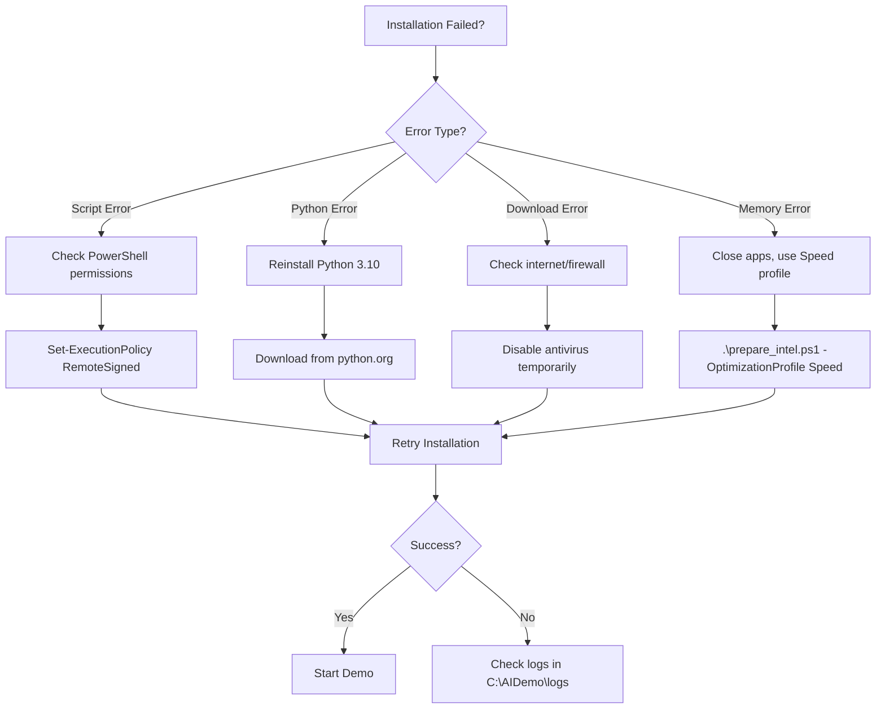

# Intel Quick Start Guide
## Get AI Image Generation Running in 15 Minutes

---

## Prerequisites Checklist

Before starting, ensure you have:

- [ ] **Windows 10 1903+ or Windows 11**
- [ ] **Intel Core i5 11th Gen or newer** (Core Ultra recommended)
- [ ] **16GB RAM minimum** (32GB recommended)
- [ ] **10GB free disk space**
- [ ] **Administrator access**
- [ ] **Internet connection** (50+ Mbps recommended)

---

## Step 1: Enable PowerShell Scripts (1 minute)

Open PowerShell as Administrator and run:

```powershell
# Enable script execution
Set-ExecutionPolicy -ExecutionPolicy RemoteSigned -Scope CurrentUser -Force

# Verify it worked
Get-ExecutionPolicy
# Should return: RemoteSigned
```

---

## Step 2: Download the Repository (2 minutes)

### Option A: Using Git
```powershell
# Navigate to your preferred directory
cd C:\

# Clone the repository
git clone https://github.com/your-repo/AI-image-gen-battle.git
cd AI-image-gen-battle\deployment
```

### Option B: Download ZIP
1. Download the repository ZIP from GitHub
2. Extract to `C:\AI-image-gen-battle`
3. Open PowerShell and navigate to:
```powershell
cd C:\AI-image-gen-battle\deployment
```

---

## Step 3: Quick System Check (1 minute)

Run a quick check to see if your system is ready:

```powershell
# Check system requirements only
.\prepare_intel.ps1 -CheckOnly

# Expected output:
# [OK] Architecture: AMD64 (Intel x64 compatible)
# [OK] Processor: Intel Core Ultra 7 155H
# [OK] RAM: 32GB
# [OK] DirectX 12 compatible OS detected
# [OK] Free space: 250.5GB
```

**If you see errors:**
- **RAM Error:** Close other applications
- **DirectX Error:** Update Windows and graphics drivers
- **Processor Warning:** Script will still work but slower

---

## Step 4: Run Installation (10-20 minutes)

### Standard Installation (Recommended)
```powershell
# Run the installation with default settings
.\prepare_intel.ps1

# You'll see:
# - Hardware detection results
# - Confirmation prompt (type 'Y' to continue)
# - Progress bars for downloads
# - Installation status messages
```

### Quick Installation (Skip Confirmations)
```powershell
# Auto-accept all prompts
.\prepare_intel.ps1 -Force
```

### Installation with Details
```powershell
# See everything that's happening
.\prepare_intel.ps1 -Verbose
```

---

## Step 5: Verify Installation (1 minute)

After installation completes, verify everything works:

```powershell
# Test DirectML is working
python -c "import torch_directml; print('DirectML:', torch_directml.is_available())"

# Should output:
# DirectML: True
```

---

## Step 6: Start the Demo (1 minute)

You now have two ways to start the AI image generator:

### Option A: Batch File (Easiest)
```powershell
# Double-click or run from PowerShell
C:\AIDemo\start_intel_demo.bat
```

### Option B: PowerShell Script
```powershell
# Run from PowerShell
C:\AIDemo\start_intel_demo.ps1
```

The application will start and display:
```
Starting Intel-optimized AI Demo Client...
Using DirectML GPU acceleration
Expected performance: 35-45 seconds per 768x768 image
Server running on http://localhost:5000
```

---

## Step 7: Generate Your First Image

1. Open your web browser
2. Navigate to: `http://localhost:5000`
3. Enter a prompt: "A beautiful sunset over mountains, highly detailed"
4. Click "Generate"
5. Wait 35-45 seconds for your image!

---

## Common Issues and Quick Fixes

### Issue 1: "Script cannot be loaded" Error

**Fix:**
```powershell
# Run as Administrator
Set-ExecutionPolicy Bypass -Scope Process -Force
.\prepare_intel.ps1
```

### Issue 2: "Python not found" Error

**Fix:** Let the script install Python automatically, or manually install:
```powershell
# Download Python 3.10.11 from python.org
# Install with "Add to PATH" checked
# Restart PowerShell and retry
```

### Issue 3: Model Download Interrupted

**Fix:** The script automatically resumes downloads:
```powershell
# Just run again - it will resume
.\prepare_intel.ps1
```

### Issue 4: Out of Memory During Generation

**Fix:** Use the Speed profile:
```powershell
# Reinstall with Speed optimization
.\prepare_intel.ps1 -OptimizationProfile Speed
```

### Issue 5: DirectML Not Available

**Fix:** Update your graphics driver:
1. Open Device Manager
2. Right-click your Intel Graphics
3. Select "Update driver"
4. Restart and retry

---

## Performance Optimization Quick Tips

### For Faster Generation (15-25 seconds):
```powershell
# Use Speed profile during setup
.\prepare_intel.ps1 -OptimizationProfile Speed

# Or modify after installation:
# Edit C:\AIDemo\client\config.json
# Set "optimization_profile": "speed"
```

### For Better Quality (50-80 seconds):
```powershell
# Use Quality profile during setup
.\prepare_intel.ps1 -OptimizationProfile Quality
```

### For Balanced Performance (35-45 seconds):
```powershell
# Default setting - no changes needed
.\prepare_intel.ps1
```

---

## What's Next?

### Customize Settings
Edit `C:\AIDemo\client\config.json`:
```json
{
  "optimization_profile": "balanced",
  "default_steps": 25,
  "default_resolution": 768,
  "port": 5000
}
```

### Use Custom Models
Place additional models in:
```
C:\AIDemo\models\
└── your-model-name\
    ├── unet\
    ├── vae\
    └── text_encoder\
```

### Enable Remote Access
Allow access from other devices:
```powershell
# Add firewall rule (already done by script)
# Find your IP address
ipconfig

# Share with others: http://YOUR_IP:5000
```

---

## Uninstallation

To completely remove the installation:

```powershell
# Remove virtual environment and models
Remove-Item C:\AIDemo -Recurse -Force

# Remove firewall rule
Remove-NetFirewallRule -DisplayName "AI Demo Intel Client"

# Python remains installed (remove manually if desired)
```

---

## Quick Command Reference

| Task | Command |
|------|---------|
| **Check requirements** | `.\prepare_intel.ps1 -CheckOnly` |
| **Preview changes** | `.\prepare_intel.ps1 -WhatIf` |
| **Full installation** | `.\prepare_intel.ps1` |
| **Fast installation** | `.\prepare_intel.ps1 -Force` |
| **Detailed installation** | `.\prepare_intel.ps1 -Verbose` |
| **Skip model download** | `.\prepare_intel.ps1 -SkipModelDownload` |
| **Speed optimization** | `.\prepare_intel.ps1 -OptimizationProfile Speed` |
| **Quality optimization** | `.\prepare_intel.ps1 -OptimizationProfile Quality` |
| **Custom log location** | `.\prepare_intel.ps1 -LogPath D:\Logs` |

---

## System Requirements Summary

### Minimum Requirements
- Intel Core i5 11th Gen
- 16GB RAM
- Windows 10 1903+
- 10GB free space
- DirectX 12 support

### Recommended Requirements
- Intel Core Ultra or i7 13th Gen+
- 32GB RAM
- Windows 11
- 20GB free SSD space
- Intel Arc Graphics

### Expected Performance
- **Resolution:** 768×768
- **Generation Time:** 35-45 seconds
- **Memory Usage:** 8-10GB
- **Quality:** Maximum (FP16 precision)

---

## Getting Help

### Check Logs
```powershell
# View latest log
Get-Content C:\AIDemo\logs\intel_setup_*.log -Tail 50

# Search for errors
Select-String -Path C:\AIDemo\logs\*.log -Pattern "ERROR"
```

### Verify Components
```powershell
# Check Python version
python --version

# Check installed packages
pip list | Select-String "torch|directml"

# Test DirectML
python -c "import torch_directml; print(torch_directml.device_name(0))"
```

### Run Diagnostics
```powershell
# Full system diagnostic
.\prepare_intel.ps1 -CheckOnly -Verbose
```

---

## Advanced Users

### Custom Python Environment
```powershell
# Use existing Python installation
$env:PYTHON_PATH = "C:\Your\Python\Path"
.\prepare_intel.ps1
```

### Offline Installation
```powershell
# Download models separately
# Place in C:\AIDemo\models\
# Then run:
.\prepare_intel.ps1 -SkipModelDownload
```

### Development Mode
```powershell
# Install with development tools
.\prepare_intel.ps1
pip install jupyter ipython pytest
```

---

## Troubleshooting Flowchart



---

## Performance Validation

After installation, validate performance:

```powershell
# Quick benchmark (takes ~2 minutes)
cd C:\AIDemo\client
python -c "
from ai_pipeline import AIImagePipeline
from platform_detection import detect_platform
import time

print('Initializing...')
platform = detect_platform()
pipeline = AIImagePipeline(platform)

print('Generating test image...')
start = time.time()
result = pipeline.generate('test', steps=25, width=768, height=768)
elapsed = time.time() - start

print(f'Generation time: {elapsed:.1f} seconds')
if elapsed < 45:
    print('[SUCCESS] Performance is optimal!')
elif elapsed < 60:
    print('[OK] Performance is acceptable')
else:
    print('[WARNING] Performance is below expectations')
"
```

---

## Success Indicators

You'll know everything is working when:

✅ **Installation shows:** "INTEL SYSTEM IS READY!"  
✅ **Test shows:** "DirectML: True"  
✅ **First image generates in:** 35-45 seconds  
✅ **Web interface loads at:** http://localhost:5000  
✅ **No error messages in:** C:\AIDemo\logs\  

---

## Quick Tips for Best Results

1. **Close unnecessary applications** before generating images
2. **Use wired internet** for model downloads (faster than WiFi)
3. **Ensure good cooling** - generation creates heat
4. **Start with 512×512** resolution for testing
5. **Use simple prompts** initially, then add complexity
6. **Let the first generation warm up** - subsequent ones are faster
7. **Monitor Task Manager** to see GPU usage during generation

---

## FAQ

**Q: How long does installation take?**  
A: 10-20 minutes with fast internet (50+ Mbps)

**Q: Can I use my computer during installation?**  
A: Yes, but avoid heavy tasks during model downloads

**Q: Will this slow down my computer?**  
A: Only during image generation (35-45 seconds)

**Q: Can I generate multiple images at once?**  
A: No, images are generated sequentially for stability

**Q: Do I need internet after installation?**  
A: No, everything runs locally offline

**Q: Can I move the installation?**  
A: No, paths are hardcoded to C:\AIDemo

**Q: Is this free to use?**  
A: Yes, all components are open source

---

## Congratulations! 🎉

You're now ready to generate AI images with Intel acceleration!

**Remember:**
- First generation is slower (warmup)
- 35-45 seconds is normal for 768×768
- Quality is maximized with FP16 models
- Check logs if anything seems wrong

**Enjoy creating amazing AI-generated images!**

---

*Quick Start Guide v1.0.0*  
*For prepare_intel.ps1 v1.0.0*  
*Last Updated: 2025-08-14*  
*Estimated Setup Time: 15-20 minutes*