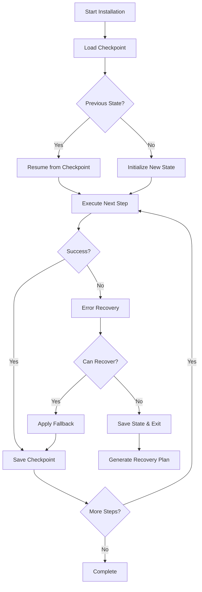

# Comprehensive Error Recovery and Fallback Architecture for Snapdragon Deployment

## Executive Summary
This architecture defines a multi-layered error recovery system that transforms the Snapdragon deployment script from a brittle, all-or-nothing installation into a resilient, self-healing system with graceful degradation capabilities.

## Core Principles
1. **Fail Forward**: Every failure has a recovery path
2. **Progressive Success**: Partial completion is better than total failure
3. **State Persistence**: All progress is saved and resumable
4. **Graceful Degradation**: Maintain functionality even without optimal components
5. **Diagnostic Transparency**: Clear visibility into what failed and why

## Architecture Overview



## Error Recovery Layers

### Layer 1: Immediate Recovery
**Purpose**: Handle transient failures without user intervention

```powershell
# Recovery Functions
- Retry-WithBackoff: Exponential backoff for network issues
- Clear-ResourceLocks: Release file/process locks
- Reset-Environment: Clean temporary state
- Refresh-Credentials: Re-authenticate if needed
```

**Implementation Pattern**:
```powershell
function Invoke-WithRecovery {
    param($Action, $MaxRetries = 3)
    
    $attempt = 0
    $lastError = $null
    
    while ($attempt -lt $MaxRetries) {
        try {
            return & $Action
        } catch {
            $lastError = $_
            $attempt++
            $backoff = [Math]::Pow(2, $attempt)
            Write-WarningMsg "Attempt $attempt failed, retrying in $backoff seconds..."
            Start-Sleep -Seconds $backoff
            
            # Apply recovery based on error type
            switch -Regex ($_.Exception.Message) {
                "network|timeout" { Reset-NetworkStack }
                "access denied" { Request-Elevation }
                "file in use" { Clear-ResourceLocks }
                default { Clear-TemporaryState }
            }
        }
    }
    
    throw $lastError
}
```

### Layer 2: Fallback Alternatives
**Purpose**: Use alternative approaches when primary method fails

#### NPU Provider Fallback Chain
```powershell
$NPU_FALLBACK_CHAIN = @(
    @{Name="QNNExecutionProvider"; Package="onnxruntime-qnn"; Score=100},
    @{Name="DmlExecutionProvider"; Package="onnxruntime-directml"; Score=80},
    @{Name="WinMLExecutionProvider"; Package="winml"; Score=60},
    @{Name="OpenVINOExecutionProvider"; Package="onnxruntime-openvino"; Score=40},
    @{Name="CPUExecutionProvider"; Package="onnxruntime"; Score=20}
)

function Select-BestProvider {
    foreach ($provider in $NPU_FALLBACK_CHAIN) {
        if (Test-ProviderAvailability $provider.Name) {
            Write-Info "Selected provider: $($provider.Name) (score: $($provider.Score))"
            return $provider
        }
    }
    return $NPU_FALLBACK_CHAIN[-1]  # CPU fallback
}
```

#### Package Installation Fallback Chain
```powershell
$PACKAGE_FALLBACK_CHAIN = @(
    "Install-FromWheelCache",
    "Install-FromBinaryWheel", 
    "Install-FromSource",
    "Install-AlternativePackage",
    "Install-MinimalVersion",
    "Skip-NonCriticalPackage"
)

function Install-PackageWithFallback {
    param($PackageName, $Version)
    
    foreach ($method in $PACKAGE_FALLBACK_CHAIN) {
        try {
            return & $method -Package $PackageName -Version $Version
        } catch {
            Write-WarningMsg "$method failed for $PackageName, trying next method..."
        }
    }
    
    # Record as optional failure
    $script:partialFailures += $PackageName
    return $false
}
```

#### Model Download Fallback Chain
```powershell
$MODEL_SOURCES = @(
    @{Name="HuggingFace"; URL="https://huggingface.co/{0}/resolve/main/{1}"},
    @{Name="Mirror1"; URL="https://mirror1.ai-models.com/{0}/{1}"},
    @{Name="Mirror2"; URL="https://mirror2.ai-models.com/{0}/{1}"},
    @{Name="LocalCache"; URL="file://C:/AIDemo/cache/models/{0}/{1}"},
    @{Name="Torrent"; URL="magnet:?xt=urn:btih:{0}"}
)

function Download-ModelWithFallback {
    param($ModelName, $FileName)
    
    foreach ($source in $MODEL_SOURCES) {
        try {
            $url = $source.URL -f $ModelName, $FileName
            return Download-WithResume -URL $url -Destination $destination
        } catch {
            Write-WarningMsg "Download from $($source.Name) failed"
        }
    }
    
    # Offer manual download option
    return Request-ManualDownload $ModelName $FileName
}
```

### Layer 3: Progressive Degradation
**Purpose**: Maintain core functionality even with reduced capabilities

```powershell
$CAPABILITY_LEVELS = @(
    @{Level=1; Name="Full NPU Acceleration"; Requirements=@("QNN", "INT8Models", "16GBRAM")},
    @{Level=2; Name="DirectML Acceleration"; Requirements=@("DirectML", "FP16Models", "8GBRAM")},
    @{Level=3; Name="CPU Optimized"; Requirements=@("MKL", "INT8Models", "8GBRAM")},
    @{Level=4; Name="Basic CPU"; Requirements=@("CPU", "FP32Models", "4GBRAM")},
    @{Level=5; Name="Minimal"; Requirements=@("CPU", "TinyModels", "2GBRAM")}
)

function Select-CapabilityLevel {
    $availableResources = Get-AvailableResources
    
    foreach ($level in $CAPABILITY_LEVELS) {
        if (Test-Requirements $level.Requirements $availableResources) {
            Write-Info "Operating at capability level $($level.Level): $($level.Name)"
            return $level
        }
    }
    
    throw "Minimum requirements not met"
}
```

## Checkpoint and Resume System

### State Management
```powershell
$CHECKPOINT_SCHEMA = @{
    Version = "1.0"
    Timestamp = $null
    MachineId = $env:COMPUTERNAME
    Progress = @{
        CompletedSteps = @()
        FailedSteps = @()
        SkippedSteps = @()
        CurrentStep = $null
        TotalSteps = 0
    }
    Environment = @{
        PythonPath = $null
        VenvPath = $null
        ModelsPath = $null
        InstalledPackages = @()
    }
    Failures = @{
        Recoverable = @()
        NonRecoverable = @()
        Warnings = @()
    }
    Performance = @{
        StartTime = $null
        ElapsedTime = $null
        SuccessRate = 0
    }
}

function Save-Checkpoint {
    param($Step, $Status)
    
    $checkpoint = Get-CurrentCheckpoint
    $checkpoint.Timestamp = Get-Date -Format "o"
    $checkpoint.Progress.CurrentStep = $Step
    
    switch ($Status) {
        "Success" { $checkpoint.Progress.CompletedSteps += $Step }
        "Failed" { $checkpoint.Progress.FailedSteps += $Step }
        "Skipped" { $checkpoint.Progress.SkippedSteps += $Step }
    }
    
    $checkpoint.Progress.SuccessRate = 
        $checkpoint.Progress.CompletedSteps.Count / $checkpoint.Progress.TotalSteps * 100
    
    $checkpointPath = "C:\AIDemo\checkpoint.json"
    $checkpoint | ConvertTo-Json -Depth 10 | Out-File $checkpointPath
    
    # Also save to alternate location in case primary fails
    $backupPath = "$env:TEMP\snapdragon_checkpoint_$(Get-Date -Format 'yyyyMMdd').json"
    Copy-Item $checkpointPath $backupPath -Force
}

function Resume-FromCheckpoint {
    $checkpointPath = "C:\AIDemo\checkpoint.json"
    
    if (Test-Path $checkpointPath) {
        $checkpoint = Get-Content $checkpointPath | ConvertFrom-Json
        
        Write-Info "Resuming from checkpoint ($(checkpoint.Progress.CompletedSteps.Count) steps completed)"
        
        # Restore environment
        $env:Path = $checkpoint.Environment.PythonPath + ";$env:Path"
        
        # Skip completed steps
        $script:completedSteps = $checkpoint.Progress.CompletedSteps
        
        return $checkpoint
    }
    
    return Initialize-NewCheckpoint
}
```

## Resource Monitoring and Throttling

### Resource Management
```powershell
function Test-ResourceAvailability {
    param($RequiredResources)
    
    $available = @{
        Memory = (Get-WmiObject Win32_OperatingSystem).FreePhysicalMemory / 1MB
        Disk = (Get-PSDrive C).Free / 1GB
        CPU = (Get-Counter "\Processor(_Total)\% Processor Time").CounterSamples.CookedValue
        Network = Test-NetworkBandwidth
        Temperature = Get-ThermalState
    }
    
    $canProceed = $true
    
    foreach ($resource in $RequiredResources.GetEnumerator()) {
        if ($available[$resource.Key] -lt $resource.Value) {
            Write-WarningMsg "Insufficient $($resource.Key): $($available[$resource.Key]) < $($resource.Value)"
            $canProceed = $false
            
            # Try to free resources
            switch ($resource.Key) {
                "Memory" { Clear-MemoryCache }
                "Disk" { Clear-TempFiles }
                "CPU" { Wait-ForCPUAvailability }
                "Temperature" { Enable-ThermalThrottling }
            }
        }
    }
    
    return $canProceed
}

function Enable-ResourceThrottling {
    $script:throttleSettings = @{
        MaxParallelDownloads = 1
        MaxMemoryUsage = 4GB
        MaxCPUUsage = 80
        EnableThermalProtection = $true
        NetworkBandwidthLimit = "50%"
    }
    
    Write-Info "Resource throttling enabled to prevent system overload"
}
```

## Rollback Mechanism

### Transaction-Based Operations
```powershell
$script:rollbackStack = @()

function Start-Transaction {
    param($OperationName)
    
    $transaction = @{
        Name = $OperationName
        StartTime = Get-Date
        Actions = @()
        State = "Active"
    }
    
    $script:currentTransaction = $transaction
    $script:rollbackStack += $transaction
}

function Add-RollbackAction {
    param($Action)
    
    if ($script:currentTransaction) {
        $script:currentTransaction.Actions += $Action
    }
}

function Commit-Transaction {
    if ($script:currentTransaction) {
        $script:currentTransaction.State = "Committed"
        $script:currentTransaction = $null
    }
}

function Rollback-Transaction {
    param($TransactionName)
    
    $transaction = $script:rollbackStack | Where-Object { $_.Name -eq $TransactionName }
    
    if ($transaction) {
        Write-WarningMsg "Rolling back $($transaction.Name)..."
        
        # Execute rollback actions in reverse order
        $transaction.Actions | Select-Object -Last $transaction.Actions.Count | ForEach-Object {
            try {
                & $_
            } catch {
                Write-ErrorMsg "Rollback action failed: $_"
            }
        }
        
        $transaction.State = "RolledBack"
    }
}
```

## Offline/Cache-First Mode

### Cache Management
```powershell
function Initialize-OfflineMode {
    $script:offlineCache = @{
        Packages = "C:\AIDemo\offline\packages"
        Models = "C:\AIDemo\offline\models"
        Installers = "C:\AIDemo\offline\installers"
        Metadata = "C:\AIDemo\offline\metadata.json"
    }
    
    # Load cache metadata
    if (Test-Path $script:offlineCache.Metadata) {
        $script:cacheMetadata = Get-Content $script:offlineCache.Metadata | ConvertFrom-Json
    }
    
    Write-Info "Offline mode initialized. Using cached resources when available."
}

function Get-CachedResource {
    param($ResourceType, $ResourceName, $Version)
    
    $cachePath = Join-Path $script:offlineCache[$ResourceType] "$ResourceName-$Version.*"
    $cached = Get-ChildItem $cachePath -ErrorAction SilentlyContinue | Select-Object -First 1
    
    if ($cached) {
        # Verify integrity
        if (Test-CacheIntegrity $cached) {
            Write-Info "Using cached $ResourceType: $ResourceName"
            return $cached.FullName
        }
    }
    
    return $null
}

function Update-OfflineCache {
    param($ResourceType, $ResourcePath)
    
    $destination = $script:offlineCache[$ResourceType]
    Copy-Item $ResourcePath $destination -Force
    
    # Update metadata
    $script:cacheMetadata.LastUpdated = Get-Date -Format "o"
    $script:cacheMetadata.Resources += @{
        Type = $ResourceType
        Path = $ResourcePath
        Hash = Get-FileHash $ResourcePath
        Timestamp = Get-Date -Format "o"
    }
    
    $script:cacheMetadata | ConvertTo-Json -Depth 10 | Out-File $script:offlineCache.Metadata
}
```

## Error Classification and Handling

### Error Categories
```powershell
$ERROR_CATEGORIES = @{
    Transient = @{
        Patterns = @("timeout", "network", "temporarily unavailable")
        Action = "Retry"
        MaxRetries = 5
    }
    Permission = @{
        Patterns = @("access denied", "permission", "unauthorized")
        Action = "Elevate"
        MaxRetries = 1
    }
    Resource = @{
        Patterns = @("insufficient", "out of memory", "disk full")
        Action = "FreeResources"
        MaxRetries = 2
    }
    Dependency = @{
        Patterns = @("not found", "missing dependency", "import error")
        Action = "InstallDependency"
        MaxRetries = 3
    }
    Configuration = @{
        Patterns = @("invalid configuration", "settings", "path not found")
        Action = "Reconfigure"
        MaxRetries = 2
    }
    Fatal = @{
        Patterns = @("critical", "fatal", "unrecoverable")
        Action = "Abort"
        MaxRetries = 0
    }
}

function Classify-Error {
    param($ErrorMessage)
    
    foreach ($category in $ERROR_CATEGORIES.GetEnumerator()) {
        foreach ($pattern in $category.Value.Patterns) {
            if ($ErrorMessage -match $pattern) {
                return $category.Key
            }
        }
    }
    
    return "Unknown"
}

function Handle-Error {
    param($Error)
    
    $category = Classify-Error $Error.Exception.Message
    $handler = $ERROR_CATEGORIES[$category]
    
    Write-VerboseInfo "Error classified as: $category"
    
    switch ($handler.Action) {
        "Retry" { 
            return Retry-WithBackoff -Action $Error.InvocationInfo.MyCommand 
        }
        "Elevate" { 
            Request-AdminRights
            return $true
        }
        "FreeResources" {
            Clear-Resources
            return $true
        }
        "InstallDependency" {
            Install-MissingDependency $Error
            return $true
        }
        "Reconfigure" {
            Reset-Configuration
            return $true
        }
        "Abort" {
            Save-CrashDump $Error
            return $false
        }
        default {
            return $false
        }
    }
}
```

## Diagnostic Logging

### Comprehensive Logging System
```powershell
$LOG_LEVELS = @{
    Debug = 0
    Verbose = 1
    Info = 2
    Warning = 3
    Error = 4
    Critical = 5
}

function Write-Log {
    param(
        $Message,
        $Level = "Info",
        $Component = "General",
        $ErrorRecord = $null
    )
    
    $logEntry = @{
        Timestamp = Get-Date -Format "o"
        Level = $Level
        Component = $Component
        Message = $Message
        MachineName = $env:COMPUTERNAME
        UserName = $env:USERNAME
        ProcessId = $PID
    }
    
    if ($ErrorRecord) {
        $logEntry.Error = @{
            Message = $ErrorRecord.Exception.Message
            Type = $ErrorRecord.Exception.GetType().FullName
            StackTrace = $ErrorRecord.ScriptStackTrace
            Line = $ErrorRecord.InvocationInfo.ScriptLineNumber
            Command = $ErrorRecord.InvocationInfo.MyCommand
        }
    }
    
    # Write to multiple destinations
    $logEntry | ConvertTo-Json -Compress | Add-Content "C:\AIDemo\logs\install.log"
    
    if ($Level -in @("Error", "Critical")) {
        $logEntry | ConvertTo-Json | Add-Content "C:\AIDemo\logs\errors.log"
    }
    
    # Also send to Windows Event Log for critical issues
    if ($Level -eq "Critical") {
        Write-EventLog -LogName Application -Source "SnapdragonAI" `
            -EventId 1000 -EntryType Error -Message $Message
    }
}
```

## Performance Metrics and Monitoring

### Performance Tracking
```powershell
$script:performanceMetrics = @{
    StepTimings = @{}
    ResourceUsage = @()
    NetworkMetrics = @()
    ErrorCounts = @{}
    SuccessRates = @{}
}

function Measure-StepPerformance {
    param($StepName, $Action)
    
    $startTime = Get-Date
    $startMemory = (Get-Process -Id $PID).WorkingSet64
    
    try {
        $result = & $Action
        $success = $true
    } catch {
        $result = $_
        $success = $false
    }
    
    $endTime = Get-Date
    $endMemory = (Get-Process -Id $PID).WorkingSet64
    
    $script:performanceMetrics.StepTimings[$StepName] = @{
        Duration = ($endTime - $startTime).TotalSeconds
        MemoryDelta = ($endMemory - $startMemory) / 1MB
        Success = $success
        Timestamp = $startTime
    }
    
    if (!$success) {
        throw $result
    }
    
    return $result
}
```

## Recovery Plan Generation

### Automated Recovery Planning
```powershell
function Generate-RecoveryPlan {
    param($FailureReport)
    
    $recoveryPlan = @{
        Generated = Get-Date -Format "o"
        FailureSummary = $FailureReport
        Steps = @()
        EstimatedTime = 0
        RequiredActions = @()
    }
    
    foreach ($failure in $FailureReport.Failures) {
        $recovery = Get-RecoveryStrategy $failure
        
        $recoveryPlan.Steps += @{
            FailedStep = $failure.Step
            Reason = $failure.Reason
            RecoveryMethod = $recovery.Method
            Commands = $recovery.Commands
            ManualActions = $recovery.ManualActions
        }
        
        $recoveryPlan.EstimatedTime += $recovery.EstimatedMinutes
    }
    
    # Generate recovery script
    $recoveryScript = @"
# Snapdragon AI Demo - Recovery Script
# Generated: $(Get-Date -Format 'yyyy-MM-dd HH:mm:ss')

# Resume from checkpoint
`$checkpoint = Get-Content 'C:\AIDemo\checkpoint.json' | ConvertFrom-Json

# Apply recovery steps
$(foreach ($step in $recoveryPlan.Steps) {
    $step.Commands -join "`n"
})

# Retry installation
.\prepare_snapdragon.ps1 -Resume -Force
"@
    
    $recoveryScript | Out-File "C:\AIDemo\recovery_$(Get-Date -Format 'yyyyMMdd_HHmmss').ps1"
    
    return $recoveryPlan
}
```

## Success Criteria and Validation

### Progressive Success Metrics
```powershell
$SUCCESS_LEVELS = @{
    Critical = @{
        MinScore = 100
        Requirements = @("Python", "VirtualEnv", "CorePackages", "Network")
    }
    Full = @{
        MinScore = 90
        Requirements = @("Critical", "NPUProvider", "OptimizedModels", "Performance")
    }
    Standard = @{
        MinScore = 70
        Requirements = @("Critical", "CPUProvider", "BasicModels")
    }
    Minimal = @{
        MinScore = 50
        Requirements = @("Critical", "MinimalPackages")
    }
}

function Evaluate-InstallationSuccess {
    $score = 0
    $maxScore = 100
    
    # Calculate component scores
    $componentScores = @{
        Python = if (Test-PythonInstallation) { 20 } else { 0 }
        VirtualEnv = if (Test-VirtualEnvironment) { 10 } else { 0 }
        NPU = if (Test-NPUAvailability) { 20 } else { 0 }
        Models = if (Test-ModelAvailability) { 15 } else { 0 }
        Packages = (Get-InstalledPackageCount / Get-RequiredPackageCount) * 20
        Performance = if ((Test-Performance) -lt 30) { 15 } else { 5 }
    }
    
    $score = ($componentScores.Values | Measure-Object -Sum).Sum
    
    # Determine success level
    foreach ($level in $SUCCESS_LEVELS.GetEnumerator() | Sort-Object { $_.Value.MinScore } -Descending) {
        if ($score -ge $level.Value.MinScore) {
            return @{
                Level = $level.Key
                Score = $score
                Details = $componentScores
                Message = "Installation completed at $($level.Key) level ($score% success)"
            }
        }
    }
    
    return @{
        Level = "Failed"
        Score = $score
        Details = $componentScores
        Message = "Installation failed to meet minimum requirements"
    }
}
```

## Conclusion

This comprehensive error recovery and fallback architecture ensures:

1. **Resilience**: Multiple recovery paths for every failure scenario
2. **Progress Preservation**: Checkpoint system prevents loss of work
3. **Graceful Degradation**: System remains functional even without optimal components
4. **Diagnostic Clarity**: Comprehensive logging and error classification
5. **Automated Recovery**: Self-healing capabilities with minimal user intervention
6. **Offline Capability**: Can operate without network connectivity
7. **Performance Optimization**: Resource monitoring and throttling prevent system overload
8. **Success Flexibility**: Progressive success levels instead of binary pass/fail

The architecture transforms the Snapdragon deployment from a fragile process to a robust, enterprise-grade installation system that can adapt to various hardware configurations and failure scenarios while maintaining core functionality.